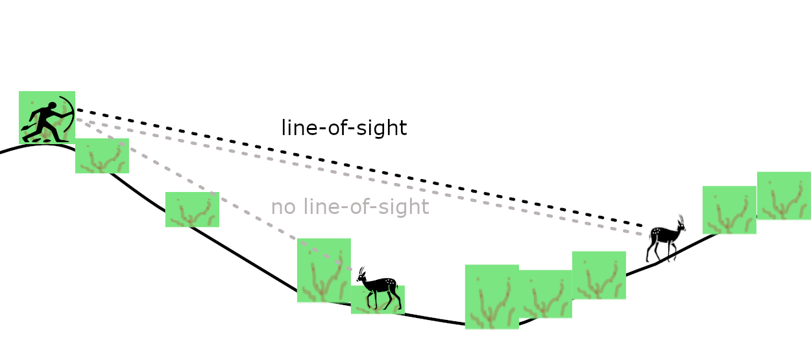
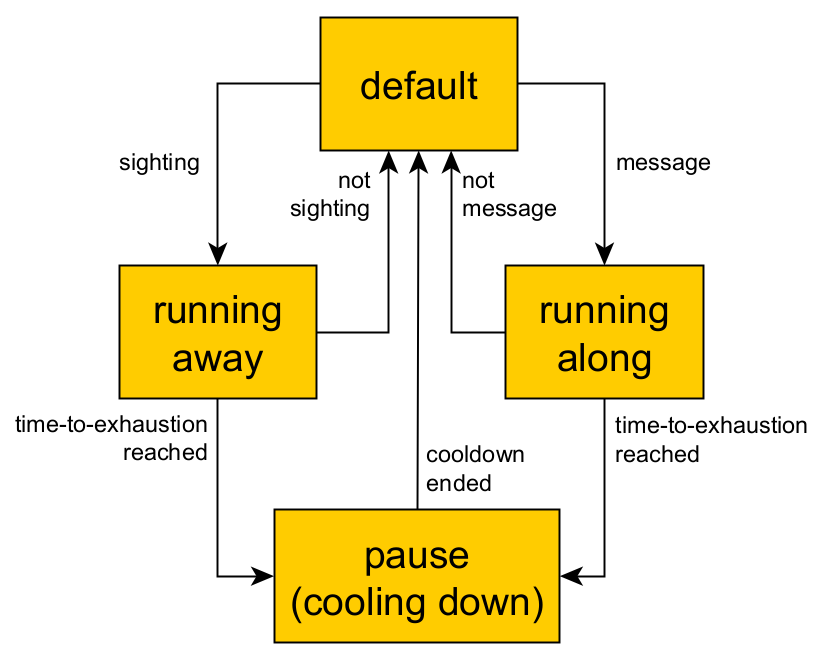

# Agent-Based Modeling of Traditional Bow-and-Arrow Hunting: A Simulation approach to Hunter and Prey Behavior
Repository for simulation models about traditional bow-and-arrow hunting, created within the framework of the [Modelling Prehistoric Hunting (MPJ) project](https://mpj.uni-koeln.de/).

# Design concepts

- Based on empirical and ethnographic studies of traditional bow-and-arrow hunting with poisonous arrows.
- Agent-based modelling

Hunting phases: 
- planning 
- hunting bout – modes:
  - searching
  - tracking 
  - spotting/approaching 
  - pursuing 
  - shooting 
- retrieval and butchering/processing

Other practices affecting hunting and foraging success (Niche construction) 
- Fire management  
- Monitoring and managing key non-prey species, such as elephants and large predators

## The Hunting Bout

The Hunting bout:
- Sequence of modes
- Often not linear (e.g., interrupted tracks, pursue not feasible, etc)
- Ends with: 
  - a successful shot, or
  - when hunters desist, considering success to be unlikely 
- Scale of seconds to hours, and metres to kilometres
The hunting bout contains phases from tracking to shooting, given that the sequence is often not a linear progression (e.g., tracking leads to dead ends, pursuit is not possible, etc.).
- Opposed goals: Hunters want to shoot and kill prey, and prey wants to escape hunters unharmed.
A hunting bout ends if there is a successful shot or when hunters desist, e.g., by considering that future shots will be unlikely. 
- The hunting bout develops in the scale of hours and metres.
- A complex game of presence, perception, stamina, speed, technology, and skill. The balance between the number of hunters for boosting perception and stealth to minimize the presence of the hunting party.
  - Hunters’ best outcome is approaching and shooting prey without first being detected.
  Prey’s best outcome is to detect hunters before they approach or to avoid detection altogether.
- Hunter and prey properties that modify (increase or decrease) presence (e.g., camouflage, stealth skill, body size, etc.), perception (e.g., sight and auditory capabilities), speed, and stamina (genetic potential and current health state).  
- Mechanisms:
  - Movement
    - Prey: default (non-alert), flee (alert)
    - Hunter: search, track, stealth approach, pursue, pause 
  - Line-of-sight
  - Sound propagation and detection 
  - Smell cloud and detection (only prey)  
- Hunter/prey properties
  - Height (proxy of presence, e.g., body weight, camouflage, stealth)
  - Speed (minimum and maximum)
  - Time to exhaustion (proxy of “stamina”, maximum VO2).
  - Reaction time (proxy of sensory and cognitive capabilities)
  - Group size increases both presence and perception (intrinsic trade-off)
  - Group composition/assets: tools and skills vary between and within hunting groups, giving a critical edge or disadvantage (e.g., tracking skills, stealth, strength of poison, quality of arrows, etc)
- Environmental conditions
  - Terrain morphology (elevation model)
  - Ground cover
  - Permeable obstacles (all vegetation)
  - Prey attractors (some vegetation, water sources, shade)
  - Prey repellers
  - Wind intensity and direction
  - Temperature
  - Overarching factors: ecological zones, seasons, fire management, key fauna (elephants, non-human predators, etc.)

## Planning, retrieving and butchering/processing
Planning and retrieving are the critical phases for cooperation and tool availability for hunting.

Group size impacts the probability of hunting success and the probability of retrieving complete and fresh prey once shot.

# Details

Hunting bout: overall cycle (per second)

Hunting bout: line of sight with permeable obstacles (i.e. vegetation)

Hunting bout: alertness, reaction and relaxation

Hunting bout: movement modes (states with transitions)

