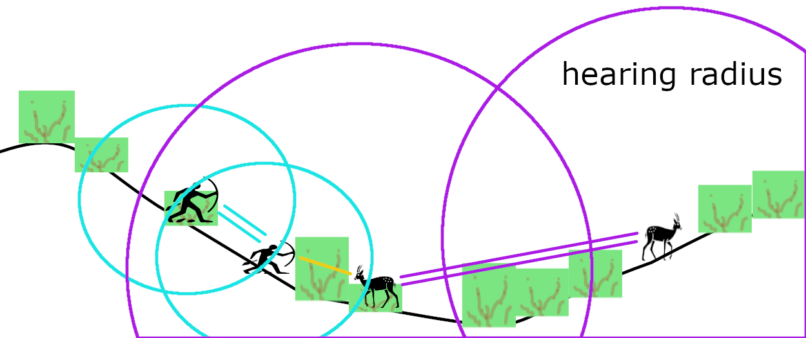

# Agent-Based Modeling of Traditional Bow-and-Arrow Hunting: A Simulation approach to Hunter and Prey Behavior
Repository for simulation models about traditional bow-and-arrow hunting, created within the framework of the [Modelling Prehistoric Hunting (MPJ) project](https://mpj.uni-koeln.de/).

The Modelling Prehistoric Hunting (MPJ) project, which expanded upon the [Indigenous Knowledge and Archaeoinformatics (IKAi) project](https://ikai.phil-fak.uni-koeln.de/en/), employed agent-based modelling to simulate dynamic human-animal interactions under changing environmental conditions. The IKAi project's collected datasets significantly informed and benefited these models, contributing to a better understanding of how climatic variation may have influenced the survival of hunter-gatherer groups.

## Model Design Concepts

### Hunting Phases
The simulation conceptualises hunting as a multi-phase process:

1. **Planning**: This phase involves cooperation and tool availability for hunting, often including discussions of routes based on wind and prior observations.
   
3. **Hunting Bout**: This is the core of the simulation, encompassing various movement modes.  

4. **Retrieval and Butchering/Processing**: The final phase, where group size impacts the probability of retrieving complete and fresh prey.

Beyond these core hunting phases, the model also incorporates "niche construction" practices that affect hunting and foraging success, such as fire management and the monitoring and managing key non-prey species like elephants and large predators. This suggests that hunter-gatherers are not merely passive foragers but can actively transform their environment to increase hunting success and survival chances.

## The Hunting Bout Model

The hunting bout is designed as a sequence of modes, which are often non-linear, acknowledging that actual hunting can involve interruptions, dead ends, or changes in strategy. A hunting bout concludes with a successful shot or when hunters decide that success is unlikely and desist. The simulation operates on a scale ranging from seconds to hours, and metres to kilometres.

The Hunting Bout Model interface in NetLogo

The fundamental interaction in the hunting bout is a "complex game of presence, perception, stamina, speed, technology, and skill". Hunters aim to approach and shoot prey undetected, while prey seek to detect hunters or avoid detection altogether. The balance between the number of hunters is crucial, as it boosts perception and increases the hunting party's presence, requiring greater stealth.

### Hunter and Prey Properties
Both hunter and prey agents possess specific properties that influence their behaviour and interactions:

- Height: A proxy for presence, influenced by factors like body weight, camouflage, and stealth.  
- Speed: Defined by minimum, maximum, and average maximum values.  
- Time to Exhaustion (Stamina): A proxy for maximum VO2.  
- Reaction Time: Represents sensory and cognitive capabilities.  
- Visual Acuity: A percentage of the maximum perception distance.  
- Hearing Radius and Field of View (FoV): Define auditory and visual detection ranges.  
- Group Size: Increases presence and perception, representing an intrinsic trade-off.  
- Group Composition/Assets: Tools and skills (e.g., tracking skills, stealth, poison strength, arrow quality) vary and can provide an advantage or disadvantage.

### Mechanisms
The model incorporates several key mechanisms to simulate realistic interactions:

- Movement: Different modes for prey (default, flee) and hunters (search, track, stealth approach, pursue, pause).
- Line-of-Sight: Accounts for permeable obstacles like vegetation.
- Sound Propagation and Detection: Influenced by the stealth of hunters.
- Smell Cloud and Detection: Specific to prey, influenced by wind speed and direction.
- Environmental Conditions: The simulated environment plays a significant role, affecting agent behaviour and hunting success:
- Terrain Morphology: Defined by an elevation model.
- Permeable Obstacles: Including all vegetation.
- Prey Attractiveness: This represents the distribution of elements such as edible vegetation, water sources, and shade.
- Wind Intensity and Direction: Crucial for hunters to avoid being scented by animals.
- Ecological Zones/Seasons, Fire Management: Broader factors influencing the environmental setup.

 

### Model Initialisation
The setup procedure initialises the simulation environment and agents. This involves:

1. Clearing Data: Resets the simulation environment.
   
3. Setting Inputs: Defines fixed constants (e.g., patch-width, max-perception-distance, good-daylight-duration, wind-spread-angle) and various parameters for environmental characteristics, hunters, and prey (e.g., num-hunters, max-shooting-distance, num-preys, prey-attractor-probability).  

4. Environment Setup: Configures obstacles, prey attraction sites, and can simulate different scenarios (e.g., "wet and no fires," "dry with fires") by setting parameters like init-obstacle-scale and fires-number.  

5. Prey Groups Setup: Creates prey agents, assigns them to groups, and positions them on the map, often away from the starting point to simulate unassigned areas. It also generates initial track-makers for pre-existing tracks, simulating recent prey activity.  

6. Hunting Party Setup: Spawns hunter agents at a designated starting point, assigning their attributes, and defining planned waypoints for their movement. These waypoints can be influenced by prey attractiveness.  

7. Perceptions Initialisation: Establishes perception links between agents (hunters and prey) to allow them to detect each other.  

8. Output Initialisation: Resets variables that track simulation outcomes, such as hunter-prey-detections, shots, and was-bout-successful.  

### Simulation Steps
The go procedure drives the simulation, orchestrating agent behaviours in a continuous cycle. Each agent reacts based on immediate sightings, memory of past interactions, and environmental context.

The main steps per second (tick) include:
1. **Detection-Based Reactions**: Agents (prey and hunters) check for immediate sightings.
    - Prey: If a hunter is seen, the prey flees or plans action based on reaction time. If they receive a message from fleeing group members, they will follow along.
    - Hunters: If prey is seen, hunters decide whether to shoot (if within range), pursue (if too far to shoot or prey is alerted), or stealthily approach (if undetected). A successful shot can lead to the hunt's success and signal the hunters to return to camp.

2. **Memory-Based Movements**: Agents without immediate sightings but with memory of previous targets.
    - Prey: Move away from the last known sighting until a safe distance is reached.
    - Hunters: Move towards the last known sighting blindly, potentially assuming a stealth posture if the target is close.

3. **Communication and Alerts**: Agents can communicate their status and memory.
    - Prey: Mimic movement based on other fleeing prey.
    - Hunters: Share success, stealth status, and unseen target locations with other hunters.

4. **Default Movements**: Agents with no recent sightings or memory.
    - Prey: Random movement modified by group cohesion and patch attractiveness, representing the browse or graze of vegetation, resting, and digesting.
    - Hunters: Track recent prey tracks or explore the area, following planned waypoints or moving towards areas of interest. Hunters often follow existing tracks or, when no tracks are found, will "search" by moving towards planned waypoints.

5. **Environmental and Status Updates**: Prey checks escape conditions (e.g., if they moved out of the hunting area). Both prey and hunters update their perception, interact with the environment (e.g., clearing vegetation obstacles by moving through them, leaving tracks), and check for exhaustion and cooldown conditions.

6. **End Condition**: The simulation stops if a successful shot occurs or a hunter returns to camp after a hunt.

The internal logic for agent decisions and state transitions within the hunting bout is further detailed by a **finite-state machine**. For example, hunters can transition between default, blind approach, stealth approach, pursue, shoot, and pause (cooling down) states, based on detection, reaction time, distance to prey, and exhaustion levels. Similarly, prey agents transition between default, running away (escape), moving away (avoidance), and pause (cooling down) states based on detection, reaction time, distance to hunters, and exhaustion levels.

States and state transitions for hunters (right) and prey (left)

To facilitate movement, the model utilises an A* pathfinding algorithm (find-a-path) to calculate optimal routes between patches, which can be adapted to consider environmental factors like obstacles for stealthy approaches.

### Data Export

The model is designed to export detailed data for analysis. For each hunter, the simulation records their ID, tick (time), x and y coordinates, and the hunting mode they were in at each step. It also exports visual representations of the simulation environment at various stages, including elevation, obstacles, attractiveness to prey, and tracks of both prey and hunters. This comprehensive data collection supports the project's goal of informing computational models of hunter-gatherer mobility and behaviour, including optimising movement strategies and search patterns.

See examples in [`output/`](https://github.com/Andros-Spica/hunter-prey-game-model/tree/main/output).
